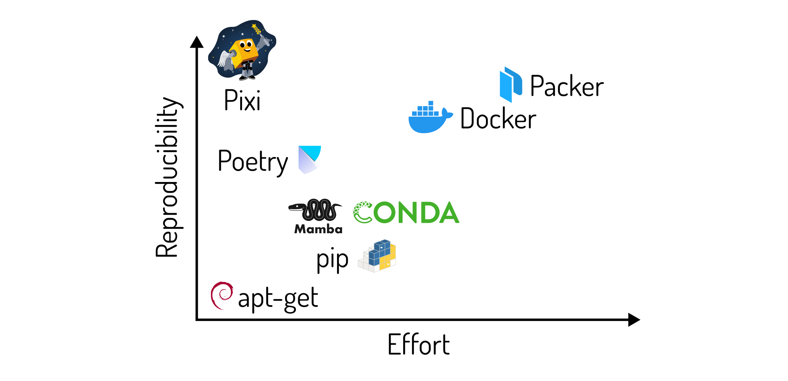
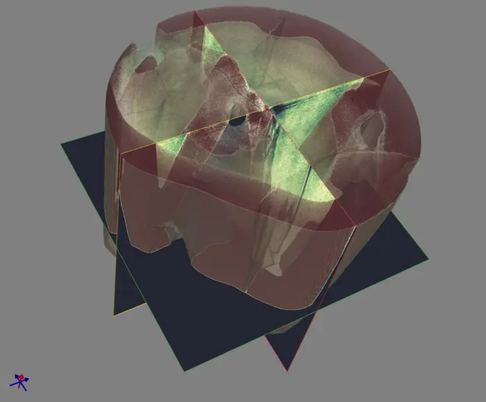
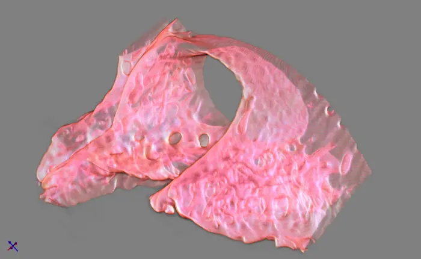

# Modern open source microCT methods to enhance accessibility, scalability, and reproducibility

> Lawrence Berkeley National Laboratory (LBNL) Advanced Light Source (ALS) User Meeting

> August, 2024

> Matt McCormick, PhD

## Outline

We will cover three topics.

### 1. Enjoyable, Reproducible Software Environments



An introduction to **[Pixi](https://pixi.sh)**, a *cross-platform package management tool to manage software environments in a reproducible way*.

We will learn how to:

- Have an **enjoyable package-management experience 😄**
- **Create cross-platform reproducible software environments** for microCT analysis and visualization 🔬
- **Forgo dependency hell 👿**

### 2. Interactive 3D Browser-based microCT Visualization



An overview of how to **visualize large-scale microCT volumes**, covering

- **How to visualize large-scale volumes in Jupyter 🌌**
- **How to modify the color and opacity transfer functions 🎨**
- **How to select different view type️s 🕹️**

### 3. Filtering Large-scale MicroCT Volumes


An overview of how to **process large-scale microCT volumes**, addressing how to

- **Avoid running out of memory 🫗**
- **Interactively select, apply, and optimize parameters on a region of interest ✅** in a Jupyter notebook
- **Process a volume in parallel ⛓️** with your bespoke Python processing code

## Start learning!

### 1. Get the source code

Either download and unpack the [repository source code ZIP file](https://github.com/thewtex/als-user-meeting-2024/archive/refs/heads/main.zip) or clone the repository with Git:

```bash
git clone https://github.com/thewtex/als-user-meeting-2024.git
cd als-user-meeting-2024
```

### 2. Install pixi

On macOS, Linux:

```bash
curl -fsSL https://pixi.sh/install.sh | bash
```

For Windows Powershell:

```powershell
iwr -useb https://pixi.sh/install.ps1 | iex
```

And restart your shell.

### 3. Start the tutorial

Change to the directory with the tutorial sources and run:

```bash
pixi run start
```

This will install all dependencies and start Jupyter.